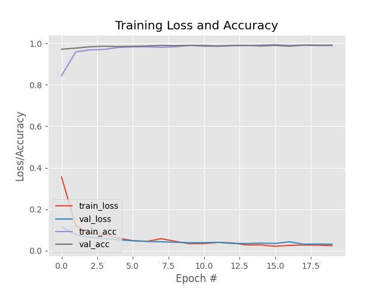
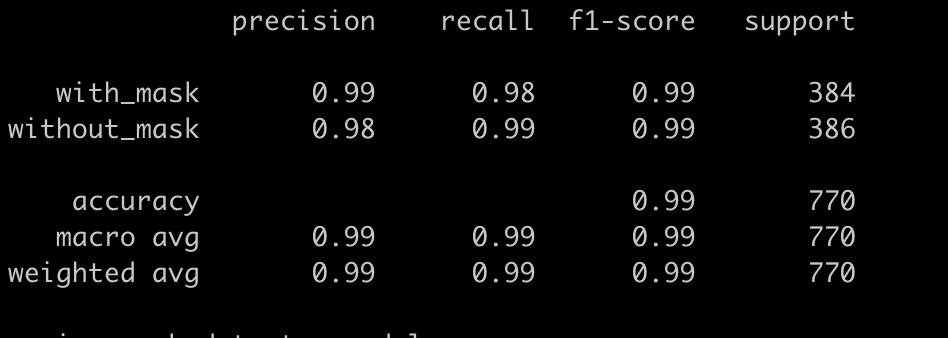
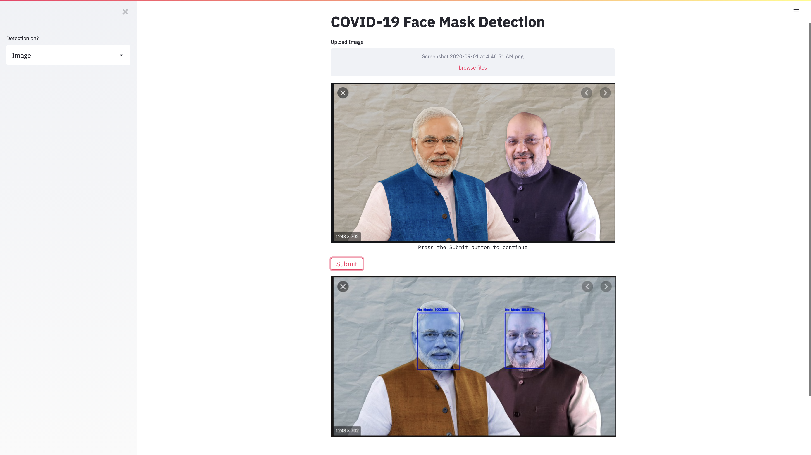

# Face-Mask-Detection

Face Mask Detector with OpenCV, Keras/TensorFlow, and Deep Learning

## Prerequisites

- [OpenCV](https://opencv.org/)
- [Caffe-based face detector](https://caffe.berkeleyvision.org/)
- [Keras](https://keras.io/)
- [TensorFlow](https://www.tensorflow.org/)
- [MobileNetV2](https://arxiv.org/abs/1801.04381)

## Working

Clone this repository in a folder :
    
    git clone https://github.com/arpita505/Face-Mask-Detection.git
    
Open terminal. Go into the cloned project directory folder and type the following command:

    python3 train_mask_detector.py --dataset dataset

To detect face masks in an image : 

    python3 detect_mask_image.py --image SOURCEIMAGE.jpg

To detect face masks in real-time video streams:

    python3 detect_mask_video.py 

To run the streamlit app:

    streamlit run app.py

## Results

  

  

Achieved a training accuracy of 99%

## Streamlit App

  

Inspiration from [https://www.pyimagesearch.com/](https://www.pyimagesearch.com/)
